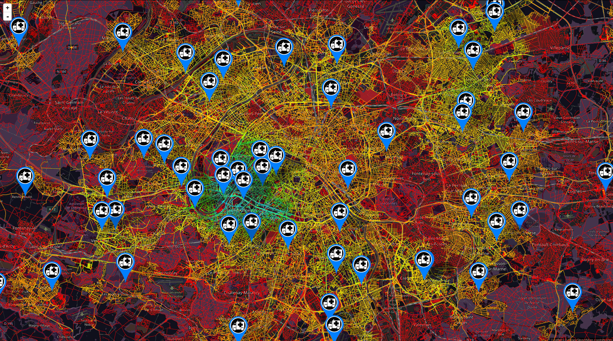
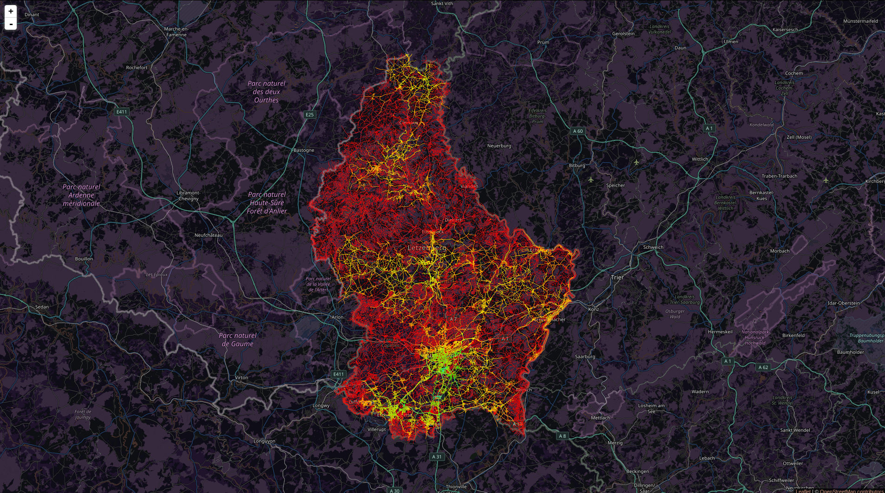

# Coverage Monitoring Service (Front-End)

This repo offers a front-end solution to project in a fast and efficient way a high resolution of the service capacity coverage information for critical dispatch services such as an emergency service.

This is made possible thanks to MapBox GL JS and the self production of vector tiles which are really small, enabling global high resolution maps, fast map loads, and efficient caching. 



For real time units tracking (UBER like) you could consider these repo:

* https://github.com/firebase/geofire-java
* https://github.com/code-and-dogs/liveMaps

A demo and usage of various free tile providers can be found here:

* https://leaflet-extras.github.io/leaflet-providers/preview/

# Installation instructions on RHEL 8 / CentOS 8 Linux

## Prerequisites

Having a working web server where to download this repo.

## Generate your own vector tiles 

In order to visualize the coverage information stored under `data/coverage`, tiles have to be generated first for regions relative to the index_###.html files available.

We save our tiles in a dedicated folder under `data/tiles/<region_name>`.

Prerequisite packages
```
sudo dnf install wget git expat sqlite-devel proj-devel libnsl
```

Git clone this repo where it will be serve by a web server (like Apache or Nginx)
```
cd /path/to/my/web/server
git clone https://github.com/ds4es/cms-frontend
cd cms-frontend
```

Pull all git submodules
```
git submodule update --init --recursive
```

#### Install GDAL (with Anaconda things are much more easier)
Install Anaconda
```
# Browse to your Downloads directory
mkdir -p ~/Downloads && cd ~/Downloads
# Download one lastest Anaconda installer suiting your OS
wget https://repo.anaconda.com/miniconda/Miniconda3-latest-Linux-x86_64.sh
# Add execute rights for this installer
chmod +x Miniconda3-latest-Linux-x86_64.sh
# Launch the installation script
./Miniconda3-latest-Linux-x86_64.sh
# Add the Anaconda bin folder location to your PATH variable.
echo 'export PATH="$HOME/miniconda3/bin:$PATH"' | tee -a ~/.bashrc
# Reload ~/.bashrc
. ~/.bashrc
```

Install GDAL
```
conda create -n gdal python
conda activate gdal
conda install -c conda-forge gdal
# Check the installation
ogr2ogr --version
```

#### Build and install tippecanoe
```
cd lib/tippecanoe
make
sudo make install
cd ../../
```

#### Generate vector tiles (example for Luxembourg)
Download any OpenStreetMap .pbf file you would like to render.
```
wget -P ./data/pbf https://download.geofabrik.de/europe/luxembourg-latest.osm.pbf
```
Convert .osm.pbf data to GeoJSON format specifying the data layer to extract, here: lines
```
conda activate gdal
ogr2ogr -f 'GeoJSON' -s_srs 'EPSG:4326' -t_srs 'EPSG:4326' './data/json/luxembourg.json' './data/pbf/luxembourg-latest.osm.pbf' lines
```
Having our data in a GeoJSON file, we can now generate tiles that way:
```
mkdir ./data/tiles/luxembourg
tippecanoe \
	--no-feature-limit \
	--no-tile-size-limit \
	--include={"osm_id","highway"} \
	--maximum-zoom=16 \
	--layer="luxembourg" \
	--output-to-directory "./data/tiles/luxembourg" \
	"./data/json/luxembourg.json"
```

If the repo has been placed under a web server (like Apache or Nginx), you should have the following rendering at http://your_web_server_url/cms-frontend/index_luxembourg.html:

